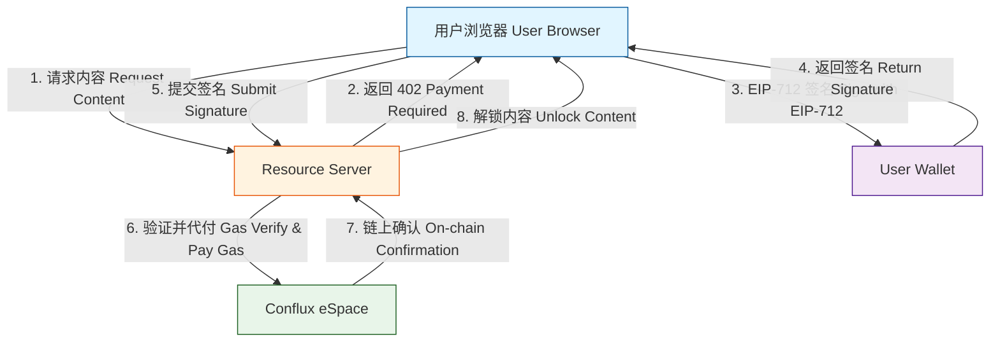
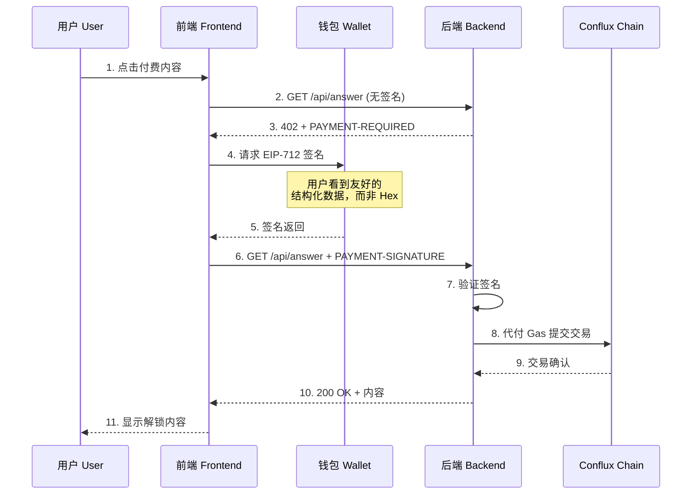
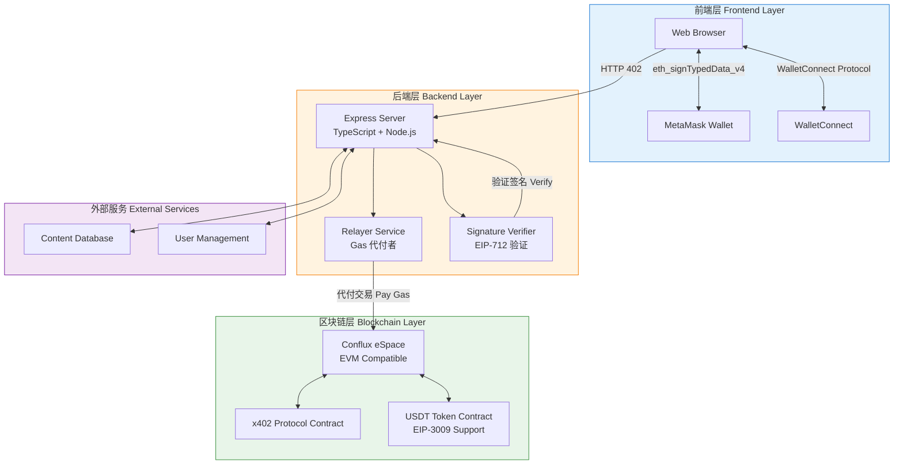
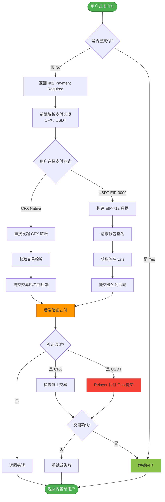

# Web3 知识付费系统 | Web3 Knowledge Payment System

<div align="center">


**基于 Conflux 公链与 x402 支付协议的 Web3 知识付费系统**

一个实现 Web2 级别用户体验的去中心化支付方案：用户无需支付 Gas 费、无需复杂网络配置，通过一次签名即可完成内容购买与解锁。

[English](#english-version) | [中文](#chinese-version)

</div>

---

## 📖 目录 | Table of Contents

- [项目概述](#项目概述--project-overview)
- [核心特性](#核心特性--key-features)
- [系统架构](#系统架构--system-architecture)
- [技术栈](#技术栈--technology-stack)
- [快速开始](#快速开始--quick-start)
- [配置说明](#配置说明--configuration)
- [API 文档](#api-文档--api-documentation)
- [安全性](#安全性--security)
- [开发路线](#开发路线--roadmap)

---

## 项目概述 | Project Overview

### 中文简介

本项目构建了一个基于 **Conflux eSpace** 公链与 **x402 支付协议** 的 Web3 知识付费系统。核心创新在于实现了"**Web2 级别的用户体验**"：

- ✅ **零 Gas 费体验**：用户无需持有 CFX 作为 Gas 费，只需要 USDT 等稳定币
- ✅ **一次签名完成支付**：无需复杂的多步骤交易确认
- ✅ **兼容主流钱包**：支持 MetaMask、WalletConnect 等
- ✅ **先体验后付费**：可以先浏览内容，满意后一键付费解锁

### English Introduction

This project builds a Web3 knowledge payment system based on **Conflux eSpace** blockchain and **x402 payment protocol**. The core innovation is achieving a "**Web2-level user experience**":

- ✅ **Zero Gas Fee**: Users don't need CFX for gas fees, only stablecoins like USDT
- ✅ **One-Signature Payment**: No complex multi-step transaction confirmations
- ✅ **Compatible with Major Wallets**: Supports MetaMask, WalletConnect, etc.
- ✅ **Try Before You Buy**: Browse content first, then unlock with one click

---

## 核心特性 | Key Features

### 🚀 Gasless 交易（Meta-Transaction）

通过 EIP-3009 标准实现用户侧零 Gas 支付，后端中继服务器代付交易手续费。



### 📱 Web2 级别的交互体验



### 🔐 EIP-712 结构化签名

用户签名时看到的不是难以理解的 Hex 字符串，而是清晰的支付信息：

```javascript
{
  contentId: "article-123",
  amount: "1000000",  // 1 USDT
  deadline: 1735689600,
  nonce: "0x..."
}
```

---

## 系统架构 | System Architecture

### 整体架构图



### 支付流程详解



---

## 技术栈 | Technology Stack

### 后端 Backend

| 技术 | 用途 | 版本 |
|------|------|------|
| **Node.js** | 运行时环境 | Latest LTS |
| **TypeScript** | 开发语言 | ^5.7.3 |
| **Express** | Web 框架 | ^4.19.2 |
| **Viem** | 以太坊交互库 | ^2.22.0 |
| **dotenv** | 环境变量管理 | ^16.4.5 |

**核心职责**：
- 作为 Relayer（中继者）处理链上交互，代付 Gas
- 验证前端提交的 EIP-712 签名
- 与 x402 协议合约交互
- 管理内容权限与用户订阅状态

### 前端 Frontend

| 技术 | 用途 |
|------|------|
| **Vanilla JavaScript** | 核心逻辑 |
| **Web3 Provider** | 钱包连接 |
| **EIP-712** | 结构化签名 |

**核心职责**：
- 支持多钱包连接（MetaMask, WalletConnect）
- 构建符合 EIP-712 标准的结构化数据
- 实现"先看后付"的交互流程

### 区块链与协议 Blockchain

| 协议/网络 | 说明 |
|----------|------|
| **Conflux eSpace** | 主网 (1030) / 测试网 (71) |
| **EIP-712** | 结构化数据签名标准 |
| **EIP-3009** | `transferWithAuthorization` 无 Gas 授权 |
| **x402 Protocol** | HTTP 402 支付协议 |

---

## 快速开始 | Quick Start

### 前置要求

- Node.js >= 18.0.0
- pnpm / npm / yarn
- MetaMask 或其他 Web3 钱包

### 安装

```bash
# 克隆仓库
git clone https://github.com/Team-White3/x402.git
cd x402

# 安装依赖
npm install
# 或使用 pnpm
pnpm install
```

### 配置环境变量

复制 `.env.example` 为 `.env` 并配置：

```bash
cp .env.example .env
```

编辑 `.env` 文件（详见 [配置说明](#配置说明--configuration)）：

```env
# 服务端口
PORT=3001

# 网络选择：false=主网(1030), true=测试网(71)
USE_TESTNET=false

# RPC 节点
MAINNET_RPC_URL=https://evm.confluxrpc.com
TESTNET_RPC_URL=https://evmtestnet.confluxrpc.com

# 收款地址
PAY_TO=0xYourTreasuryAddress

# CFX 支付价格（18 decimals）
CFX_PRICE_UNITS=100000000000000000  # 0.1 CFX

# EIP-3009 配置（可选，用于 USDT 支付）
ENABLE_EIP3009=true
TOKEN_ADDRESS=0xYourUsdtAddress
USDT_PRICE_UNITS=1000000  # 1 USDT (6 decimals)
RELAYER_PRIVATE_KEY=0xYourRelayerPrivateKey
```

### 启动服务

```bash
# 开发模式（热重载）
npm run dev

# 生产模式
npm run build
npm start
```

### 浏览器演示

1. 访问 `http://localhost:3001/`
2. 点击 **Connect Wallet** 连接 MetaMask
3. 输入问题并点击 **Pay & Request**
4. 钱包会弹出签名请求（显示清晰的支付信息）
5. 确认签名后，后台自动处理并解锁内容

---

## 配置说明 | Configuration

### 环境变量详解

#### 基础配置

| 变量 | 说明 | 默认值 | 必填 |
|------|------|--------|------|
| `PORT` | 服务端口 | `3001` | ❌ |
| `USE_TESTNET` | 是否使用测试网 | `false` | ❌ |
| `MAINNET_RPC_URL` | 主网 RPC | `https://evm.confluxrpc.com` | ❌ |
| `TESTNET_RPC_URL` | 测试网 RPC | `https://evmtestnet.confluxrpc.com` | ❌ |
| `PAY_TO` | 收款地址 | - | ✅ |

#### CFX 支付配置

| 变量 | 说明 | 默认值 |
|------|------|--------|
| `CFX_PRICE_UNITS` | 价格（最小单位） | `100000000000000000` (0.1 CFX) |
| `MAX_TIMEOUT_SECONDS` | 支付超时时间 | `3600` |
| `PENDING_WAIT_MS` | 等待确认超时 | `5000` |
| `RETRY_AFTER_SECONDS` | 重试间隔 | `5` |

#### EIP-3009 配置（USDT 支付）

| 变量 | 说明 | 默认值 | 必填 |
|------|------|--------|------|
| `ENABLE_EIP3009` | 启用 USDT 支付 | `false` | ❌ |
| `TOKEN_ADDRESS` | USDT 合约地址 | - | ⚠️ |
| `TOKEN_NAME` | EIP-712 name | `USDT` | ❌ |
| `TOKEN_VERSION` | EIP-712 version | `1` | ❌ |
| `TOKEN_DECIMALS` | Token 精度 | `6` | ❌ |
| `USDT_PRICE_UNITS` | USDT 价格 | `1000000` (1 USDT) | ❌ |
| `RELAYER_PRIVATE_KEY` | Relayer 私钥 | - | ⚠️ |

> ⚠️ 当 `ENABLE_EIP3009=true` 时必填

### 网络配置

#### Conflux eSpace 主网

```javascript
{
  chainId: 1030,
  name: "Conflux eSpace",
  rpcUrls: ["https://evm.confluxrpc.com"],
  nativeCurrency: {
    name: "CFX",
    symbol: "CFX",
    decimals: 18
  },
  blockExplorerUrls: ["https://evm.confluxscan.io"]
}
```

#### Conflux eSpace 测试网

```javascript
{
  chainId: 71,
  name: "Conflux eSpace Testnet",
  rpcUrls: ["https://evmtestnet.confluxrpc.com"],
  nativeCurrency: {
    name: "CFX",
    symbol: "CFX",
    decimals: 18
  },
  blockExplorerUrls: ["https://evmtestnet.confluxscan.io"]
}
```

---

## API 文档 | API Documentation

### 目录结构

```
./
├── src/
│   └── index.ts          # Resource Server (Express + TypeScript)
├── public/
│   ├── index.html        # Browser Demo UI
│   └── app.js            # Frontend Logic
├── package.json
├── tsconfig.json
├── .env.example
└── README.md
```

### HTTP 402 Payment Flow

#### 1. 未支付请求

**Request:**
```http
GET /api/answer?q=hello HTTP/1.1
Host: localhost:3001
```

**Response:**
```http
HTTP/1.1 402 Payment Required
PAYMENT-REQUIRED: eyJ4NDAyVmVyc2lvbiI6MiwiZXJyb3IiOi...

(Base64 编码的 JSON)
```

**解码后的 PAYMENT-REQUIRED:**
```json
{
  "x402Version": 2,
  "error": "Payment required",
  "resource": {
    "url": "http://localhost:3001/api/answer",
    "description": "Paid API response",
    "mimeType": "application/json"
  },
  "accepts": [
    {
      "scheme": "exact",
      "network": "eip155:1030",
      "amount": "100000000000000000",
      "asset": "CFX",
      "payTo": "0xYourTreasuryAddress",
      "maxTimeoutSeconds": 3600
    },
    {
      "scheme": "exact",
      "network": "eip155:1030",
      "amount": "1000000",
      "asset": "USDT",
      "payTo": "0xYourTreasuryAddress",
      "maxTimeoutSeconds": 3600,
      "tokenAddress": "0xYourUsdtAddress",
      "tokenSymbol": "USDT",
      "tokenDecimals": 6,
      "eip3009": {
        "name": "USDT",
        "version": "1",
        "chainId": 1030
      }
    }
  ]
}
```

#### 2. 已支付请求（CFX）

**Request:**
```http
GET /api/answer?q=hello HTTP/1.1
Host: localhost:3001
PAYMENT-SIGNATURE: eyJ4NDAyVmVyc2lvbiI6MiwidHhIYXNoI...
```

**PAYMENT-SIGNATURE (解码后):**
```json
{
  "x402Version": 2,
  "resource": { "url": "http://localhost:3001/api/answer" },
  "accepted": {
    "scheme": "exact",
    "network": "eip155:1030",
    "amount": "100000000000000000",
    "asset": "CFX",
    "payTo": "0xYourTreasuryAddress"
  },
  "txHash": "0x..."
}
```

#### 3. 已支付请求（USDT EIP-3009）

**PAYMENT-SIGNATURE (解码后):**
```json
{
  "x402Version": 2,
  "resource": { "url": "http://localhost:3001/api/answer" },
  "accepted": {
    "scheme": "exact",
    "network": "eip155:1030",
    "amount": "1000000",
    "asset": "USDT",
    "payTo": "0xYourTreasuryAddress",
    "tokenAddress": "0xYourUsdtAddress",
    "tokenSymbol": "USDT",
    "tokenDecimals": 6,
    "eip3009": {
      "name": "USDT",
      "version": "1",
      "chainId": 1030
    }
  },
  "eip3009Authorization": {
    "from": "0xBuyerAddress",
    "to": "0xYourTreasuryAddress",
    "value": "1000000",
    "validAfter": 1700000000,
    "validBefore": 1700003600,
    "nonce": "0x...",
    "signature": "0x..."
  }
}
```

**Response (成功):**
```http
HTTP/1.1 200 OK
Content-Type: application/json

{
  "answer": "响应内容..."
}
```

### EIP-712 数据结构

#### Domain

```javascript
const domain = {
  name: 'USDT',  // 或其他 Token 名称
  version: '1',
  chainId: 1030,  // Conflux eSpace 主网
  verifyingContract: '0x...'  // Token 合约地址
};
```

#### Types

```javascript
const types = {
  TransferWithAuthorization: [
    { name: 'from', type: 'address' },
    { name: 'to', type: 'address' },
    { name: 'value', type: 'uint256' },
    { name: 'validAfter', type: 'uint256' },
    { name: 'validBefore', type: 'uint256' },
    { name: 'nonce', type: 'bytes32' }
  ]
};
```

#### 前端签名示例

```javascript
// 构建消息数据
const message = {
  from: userAddress,
  to: payToAddress,
  value: '1000000',  // 1 USDT
  validAfter: Math.floor(Date.now() / 1000),
  validBefore: Math.floor(Date.now() / 1000) + 3600,
  nonce: ethers.utils.hexlify(ethers.utils.randomBytes(32))
};

// 请求签名
const signature = await ethereum.request({
  method: 'eth_signTypedData_v4',
  params: [
    userAddress,
    JSON.stringify({ domain, types, primaryType: 'TransferWithAuthorization', message })
  ]
});
```

#### 后端验证示例

```typescript
import { recoverTypedDataAddress } from 'viem';

async function verifySignature(
  message: any,
  signature: string
): Promise<boolean> {
  const recoveredAddress = await recoverTypedDataAddress({
    domain,
    types,
    primaryType: 'TransferWithAuthorization',
    message,
    signature
  });
  
  return recoveredAddress.toLowerCase() === message.from.toLowerCase();
}
```

---

## 安全性 | Security

### 1. 防重放攻击 (Replay Protection)

#### Nonce 机制

```typescript
// 每次签名使用唯一的 nonce
const usedAuthorizations = new Set<string>();

function checkNonce(nonce: string): boolean {
  if (usedAuthorizations.has(nonce)) {
    return false;  // 已使用
  }
  usedAuthorizations.add(nonce);
  return true;
}
```

**改进建议**：
- 使用数据库持久化 nonce
- 设置 nonce 过期时间
- 实现分布式锁机制

### 2. 签名验证

```typescript
// 1. 验证签名有效性
const isValid = await verifySignature(message, signature);

// 2. 验证时间窗口
const now = Math.floor(Date.now() / 1000);
if (now < message.validAfter || now > message.validBefore) {
  throw new Error('Authorization expired');
}

// 3. 验证金额和接收方
if (message.value !== expectedAmount || message.to !== payToAddress) {
  throw new Error('Invalid payment parameters');
}
```

### 3. Gas 价格保护

```typescript
// 监控 Gas 价格，避免过高成本
const gasPrice = await publicClient.getGasPrice();
const maxGasPrice = parseGwei('100');  // 设置上限

if (gasPrice > maxGasPrice) {
  // 等待或拒绝交易
  throw new Error('Gas price too high');
}
```

### 4. 私钥管理

⚠️ **重要提示**：

- **永远不要**将 `RELAYER_PRIVATE_KEY` 提交到版本控制
- 使用环境变量或密钥管理服务（如 AWS KMS）
- 生产环境建议使用多签钱包作为 Relayer
- 定期轮换 Relayer 密钥

```bash
# .gitignore
.env
.env.local
.env.production
```

### 5. 速率限制

```typescript
import rateLimit from 'express-rate-limit';

const limiter = rateLimit({
  windowMs: 15 * 60 * 1000,  // 15 分钟
  max: 100  // 最多 100 次请求
});

app.use('/api/', limiter);
```

---

## 开发路线 | Roadmap

### ✅ 已完成 (Completed)

- [x] HTTP 402 协议实现
- [x] CFX 原生支付支持
- [x] EIP-3009 USDT 支付
- [x] EIP-712 结构化签名
- [x] Relayer Gas 代付
- [x] 浏览器端 Demo
- [x] 主网/测试网切换

### 🚧 进行中 (In Progress)

- [ ] Nonce 持久化（数据库）
- [ ] 支付历史记录
- [ ] 用户权限管理系统
- [ ] 更完善的错误处理

### 📋 计划中 (Planned)

- [ ] 多种内容类型支持（视频、音频、文档）
- [ ] 订阅制付费模式
- [ ] NFT 会员卡功能
- [ ] 创作者收益分成
- [ ] 移动端 SDK
- [ ] Chrome 浏览器插件
- [ ] 多语言支持
- [ ] 管理后台

### 💡 探索中 (Exploring)

- [ ] Layer 2 扩容方案
- [ ] 跨链支付支持
- [ ] DID 身份系统集成
- [ ] 去中心化存储（IPFS/Arweave）
- [ ] DAO 治理模块

---

## 贡献指南 | Contributing

我们欢迎所有形式的贡献！

### 如何贡献

1. Fork 本仓库
2. 创建特性分支 (`git checkout -b feature/AmazingFeature`)
3. 提交更改 (`git commit -m 'Add some AmazingFeature'`)
4. 推送到分支 (`git push origin feature/AmazingFeature`)
5. 开启 Pull Request

### 代码规范

- 使用 TypeScript
- 遵循 ESLint 规则
- 编写单元测试
- 更新相关文档

---

## 许可证 | License

本项目采用 MIT 许可证 - 详见 [LICENSE](LICENSE) 文件

---

## 联系方式 | Contact

- **项目地址**: [https://github.com/Team-White3/x402](https://github.com/Team-White3/x402)
- **问题反馈**: [Issues](https://github.com/Team-White3/x402/issues)
- **技术讨论**: [Discussions](https://github.com/Team-White3/x402/discussions)

---

## 致谢 | Acknowledgments

- [Conflux Network](https://confluxnetwork.org/) - 提供高性能 EVM 兼容链
- [x402 Protocol](https://x402.org/) - HTTP 402 支付标准
- [Viem](https://viem.sh/) - 优秀的以太坊库
- [EIP-712](https://eips.ethereum.org/EIPS/eip-712) - 结构化数据签名标准
- [EIP-3009](https://eips.ethereum.org/EIPS/eip-3009) - Gas 抽象标准

---

<div align="center">

**⭐ 如果这个项目对你有帮助，请给我们一个 Star！**

Made with ❤️ by Team White3

</div>
